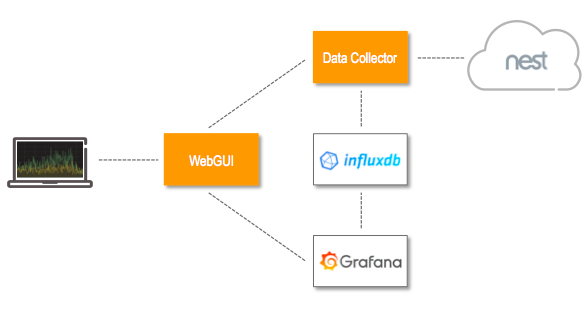

# Kubernetes Engine demo

This demo describes how to build a home temperature monitoring system on [Kubernetes Engine](https://cloud.google.com/kubernetes-engine/). The system periodically connects to your [Nest](https://nest.com/) account and retrieves all the available temperatures from your Nest thermostats and temperature sensors. All the data is stored in an [InfluxDB](https://www.influxdata.com/time-series-platform/influxdb/) time series database, and presented through [Grafana](https://grafana.com/) dashboards.

The system is designed to work with a single Nest account and does not have any scalability, reliability or performance requirement. All the components could be easily packed on a single physical or virtual machine. The choice to use [Kubernetes Engine](https://cloud.google.com/kubernetes-engine/) is merely dictated by the intent to illustrate some of its features.

In order to complete the demo you need both a Nest [developer account](https://developers.nest.com/) and a Google Cloud Platform [account](https://cloud.google.com/). The work is broken down in the following steps:
1. [Create the cluster](./docs/cluster.md)
2. [Deploy the WebGUI](./docs/webgui.md)
3. [Create the Nest OAuth client](./docs/oauth.md)
4. [Deploy the Data Collector](./docs/collector.md)
5. [Deploy InfluxDB](./docs/influxdb.md)
6. [Deploy Graphana](./docs/grafana.md)
7. [Protect the WebGUI with Google Sign-In](./docs/login.md)
8. [Configure Cloud Armor for DDoS protection](./docs/ddos.md)

This demo uses multiple billed resources on [Google Cloud Platform](https://cloud.google.com/products/). Please refer to the [cleaning-up section](./docs/cleaning.md) for further information, and for instructions on how to delete all the resources after you have finished with the demo.
