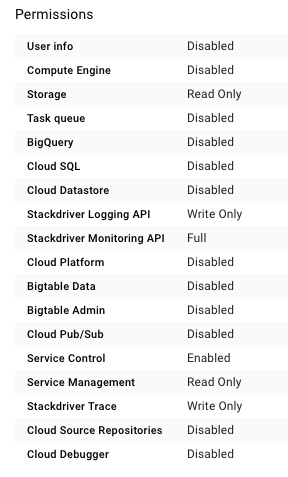

## Create the cluster

Create a [Kubernetes Engine](https://cloud.google.com/kubernetes-engine/) cluster following the instructions [here](https://cloud.google.com/kubernetes-engine/docs/quickstart). Make sure that the selected Kubernetes version is 1.9 or later.

This demo does not have any specific requirements in terms of cluster size and machine types, but one single vCPU is not sufficient to schedule all the containers. You may opt to create a cluster with two nodes of `n1-standard-1` type.

Part of the demo is focused on showing the use of [service accounts](https://cloud.google.com/iam/docs/service-accounts) to control access to cloud services. For that part to meaningful, you should not grant the cluster nodes access to the Cloud Platform APIs. Here is the recommended set of permissions for the cluster nodes:



Once finished, use the following [gcloud](https://cloud.google.com/sdk/gcloud/) commands to make sure that your shell is pointing to the right project, compute zone and cluster.

```
gcloud config set project [PROJECT_ID]

gcloud config set compute/zone [COMPUTE_ZONE]

gcloud container clusters get-credentials [CLUSTER_NAME]
```

Then, continue with the [next step](./webgui.md).
